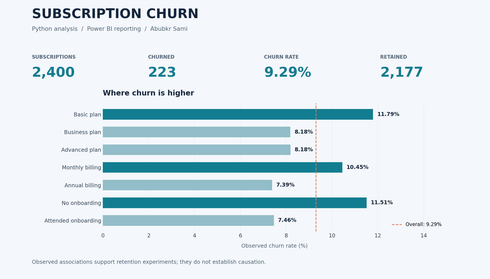

# Subscription Churn Analysis

### Understanding cancellation patterns with Python and Power BI

**Abubkr Sami** · Data analyst portfolio · [GitHub](https://github.com/ASKE-hub)

An analysis of **2,400 subscriptions** that connects data quality checks, customer segmentation, statistical testing, and an interpretable churn model with an Arabic Power BI dashboard. The goal is to identify retention priorities and communicate what the evidence can support.

[Explore the notebook](notebooks/subscriptionChurn.ipynb) · [Read the Arabic report](reports/Subscription_Churn_Analysis_Report_AR.pdf) · [Download the Power BI file](powerbi/SubscriptionChurn.pbix) · [Run the Python analysis](src/Subscription_Churn_Analysis_Code.py)



*This graphic is generated from the Python analysis. The interactive Power BI report is provided separately as a `.pbix` file.*

## Project at a glance

| Measure | Result |
|---|---:|
| Subscriptions analyzed | 2,400 |
| Customers who churned | 223 |
| Customers retained | 2,177 |
| Observed churn rate | 9.29% |
| Source columns | 12 |
| Missing values / duplicate rows | 0 / 0 |

**Tools:** Python, pandas, NumPy, SciPy, statsmodels, scikit-learn, Matplotlib, Seaborn, Jupyter, and Power BI.

## Business questions

- How do churned and retained customers differ in support demand and product engagement?
- Which plan, billing, and onboarding segments have higher observed churn?
- Which associations remain after adjusting for other measured characteristics?
- How useful is a simple churn model when only about 9% of customers cancel?

## Key findings

| Finding | Evidence | Decision it can inform |
|---|---|---|
| Support demand is the strongest numeric signal examined | Churned customers average **4.04** tickets versus **2.66** for retained customers; Cohen's d = **0.44** | Investigate repeat support issues and pilot proactive follow-up |
| Onboarding attendance is associated with lower churn | **7.46%** among attendees versus **11.51%** among non-attendees | Test onboarding completion and re-engagement initiatives |
| Monthly billing has higher observed churn | **10.45%** monthly versus **7.39%** annual | Test whether a suitable annual-plan offer improves retention |
| The basic plan has the highest observed churn | **11.79%**, compared with approximately **8.18%** for each of the other plans | Review basic-plan value and customer expectations |
| Churned customers use the product less | **27.26** versus **30.50** average monthly sessions | Explore engagement signals alongside support history |

These are **observational associations**, not demonstrated causes. Payment method, tenure, and discount percentage did not show statistically significant unadjusted associations at the 5% level. Multiple exploratory comparisons were made without a multiple-testing correction; treat individual p-values as exploratory evidence.

## Analytical approach

1. **Validate and prepare:** check the schema, missing values, duplicate subscribers, dates, binary labels, and numeric ranges; encode Arabic yes/no values as 0/1.
2. **Explore:** compare means, medians, standard deviations, and segment churn rates.
3. **Measure associations:** apply Welch's t-tests with Cohen's d and chi-square tests with Cramer's V.
4. **Adjust for other features:** fit a full-sample logistic regression and report odds ratios with 95% confidence intervals.
5. **Evaluate a predictive baseline:** use a stratified 75/25 split and a balanced logistic regression. Scaling and one-hot encoding are fitted on the training split inside a scikit-learn pipeline.
6. **Communicate:** export the cleaned Arabic dataset for Power BI, analytical tables, a visual summary, and model metrics.

The explanatory model and predictive model serve different purposes. Monthly price is excluded from the explanatory model because the source data ties price to plan; it is retained in the supplied predictive specification. The analytical choices in the supplied Python file are preserved.

### Adjusted associations

| Feature | Adjusted odds ratio | 95% confidence interval |
|---|---:|---:|
| Support tickets, +1 standard deviation | 1.481 | 1.311–1.673 |
| Monthly sessions, +1 standard deviation | 0.784 | 0.679–0.905 |
| Attended onboarding vs. did not attend | 0.607 | 0.458–0.805 |
| Business plan vs. basic | 0.676 | 0.478–0.957 |
| Advanced plan vs. basic | 0.639 | 0.458–0.893 |
| Monthly billing vs. annual | 1.481 | 1.093–2.009 |

An odds ratio describes a change in **odds**, not an equivalent percentage-point change in churn probability. Full results, including the other fitted variables, are available in [adjusted_odds_ratios.csv](reports/results/adjusted_odds_ratios.csv).

## Model performance

Evaluation uses **600 held-out records**, including **56 churn cases**, a fixed random seed of 42, and the default decision threshold of 0.5.

| Metric | Result |
|---|---:|
| Accuracy | 62.8% |
| Precision | 12.2% |
| Recall | 48.2% |
| F1 | 0.195 |
| ROC-AUC | 0.628 |
| Average precision | 0.135 |

| Actual / predicted | Retained | Churned |
|---|---:|---:|
| Retained | 350 | 194 |
| Churned | 29 | 27 |

The model identifies **27 of 56 churn cases**, with **194 false positives**. Predicting every test customer as retained would achieve **90.7% accuracy** but detect zero churn cases. Average precision is modestly above the test churn prevalence of **0.0933**. The PDF labels this score “PR-AUC”; the code computes scikit-learn's **average precision**, rather than trapezoidal area under the precision-recall curve.

This is an exploratory baseline. Its low precision and modest ranking performance support further investigation and experiments; they do not justify automated retention decisions. No improvement in customer retention has been measured by this project.

## Power BI dashboard

The supplied [Power BI report](powerbi/SubscriptionChurn.pbix) contains:

- KPI cards for total, retained, and churned customers, plus churn rate.
- Churn comparisons by plan, billing cycle, and onboarding attendance.
- Support-ticket and monthly-session comparisons by subscription status.
- Slicers for plan, billing cycle, and payment method.

See the [Power BI guide](docs/POWER_BI.md) for refresh instructions and a suggested review path. The `.pbix` is preserved as supplied; opening and refreshing it requires Power BI Desktop. Its embedded model contains subscriber-level records.

## Run the project

### 1. Install dependencies

Use Python **3.11 or later**. The exact local versions used for validation are recorded in [requirements.txt](requirements.txt).

```bash
python -m venv .venv
```

Activate the environment:

```powershell
# Windows PowerShell
.venv\Scripts\Activate.ps1
```

```bash
# macOS / Linux
source .venv/bin/activate
```

```bash
python -m pip install -r requirements.txt
```

### 2. Supply the dataset

Place the original `subscriptions-churn.csv` in `data/raw/`. The standalone source CSV is not distributed in this repository. See [data requirements](data/README.md) and the [data dictionary](docs/DATA_DICTIONARY.md).

### 3. Execute the analysis

From the repository root:

```bash
python src/Subscription_Churn_Analysis_Code.py
```

Or specify another source location:

```bash
python src/Subscription_Churn_Analysis_Code.py --input "path/to/subscriptions-churn.csv"
```

The command writes aggregate results to `reports/results/` and the Power BI input to `data/processed/subscriptions_churn_clean.csv`. Generated subscriber-level CSVs are ignored by Git. The original input is not changed.

To explore the notebook:

```bash
python -m pip install -r requirements-notebook.txt
jupyter lab notebooks/subscriptionChurn.ipynb
```

The notebook reads `data/raw/subscriptions-churn.csv` by default. Alternatively set the `CHURN_DATA_PATH` environment variable before launching Jupyter. It includes saved analysis outputs for review without running the dataset locally.

## Repository structure

```text
DaxBi/
├── README.md
├── requirements.txt
├── requirements-notebook.txt
├── src/Subscription_Churn_Analysis_Code.py
├── notebooks/subscriptionChurn.ipynb
├── powerbi/SubscriptionChurn.pbix
├── reports/
│   ├── Subscription_Churn_Analysis_Report_AR.pdf
│   └── results/                   # Aggregate tables, metrics, and visual
├── data/README.md                 # Data placement and provenance notes
├── docs/
│   ├── DATA_DICTIONARY.md
│   ├── POWER_BI.md
│   └── VALIDATION.md
└── tests/test_analysis.py
```

## Limitations and next steps

- The records provide observed churn status rather than a defined future prediction horizon. Feature timing relative to cancellation is unspecified, so prospective leakage cannot be ruled out.
- A single random split is used; cross-validation and a time-based holdout would better assess stability and generalization.
- Additional information such as support resolution quality, cancellation dates, and customer value could improve the analysis.
- A useful next step is a controlled retention pilot for repeat-support customers, with outcomes measured against a comparison group over 30–60 days.
- Any threshold tuning should use validation data and business costs, with the final test set kept separate.

## ملخص بالعربية

يحلل هذا المشروع بيانات **2,400 مشترك** باستخدام **Python وPower BI**، وبلغ عدد العملاء الملغين **223** بنسبة **9.29%**. يشمل العمل فحص جودة البيانات، والتحليل الاستكشافي، واختبارات إحصائية، وانحدارًا لوجستيًا، ولوحة تفاعلية لعرض مؤشرات الإلغاء.

أبرز النتائج هي ارتباط ارتفاع تذاكر الدعم بزيادة الإلغاء، وانخفاض الإلغاء لدى من حضروا التهيئة، وارتفاعه في الفوترة الشهرية والباقة الأساسية. النتائج ارتباطية ولا تثبت السببية، والنموذج التنبؤي استكشافي ويحتاج إلى تحسين وتحقق إضافي قبل الاستخدام التشغيلي.

[قراءة التقرير العربي الكامل](reports/Subscription_Churn_Analysis_Report_AR.pdf)

## Author and context

**Abubkr Sami** · [ASKE-hub](https://github.com/ASKE-hub)

Prepared as a portfolio project in the context of **مجتمع البيانات العربي (Arab Data Community)**, as identified in the supplied project materials. The original dataset publisher, download URL, and redistribution license were not supplied. No claim of ownership or redistribution permission is made for the source dataset. The original Arabic report and Power BI file are included as provided.
